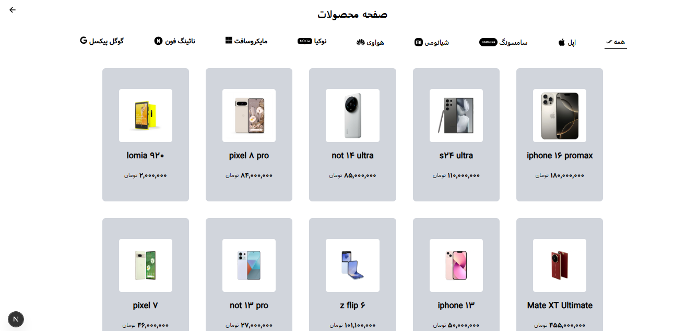

# Parmisar Phone Shop

A modern e-commerce platform for mobile phones built with Next.js, TypeScript, and Chakra UI.

## 🚀 Features

- Modern user interface
- Product catalog with detailed phone specifications
- Shopping cart functionality
- User authentication and authorization
- TypeScript for type safety

## 🛠️ Tech Stack

- **Framework:** Next.js 15.2.1
- **Language:** TypeScript
- **Styling:** Tailwind CSS
- **HTTP Client:** Axios
- **Icons:** React Icons
- **Notifications:** React Toastify

## ScreenShots




## 📦 Installation

1. Clone the repository:

```bash
git clone [https://github.com/Parisa-Esmaeilpour1993/Parmisar_Phone_shop.git]
cd parmisar_phone_shop
```

2. Install dependencies:

```bash
npm install
```

3. Run the development server:

```bash
npm run dev
```

```

## 🔧 Configuration

The project uses several configuration files:

- `next.config.ts` - Next.js configuration
- `tsconfig.json` - TypeScript configuration
- `postcss.config.mjs` - PostCSS configuration

```
